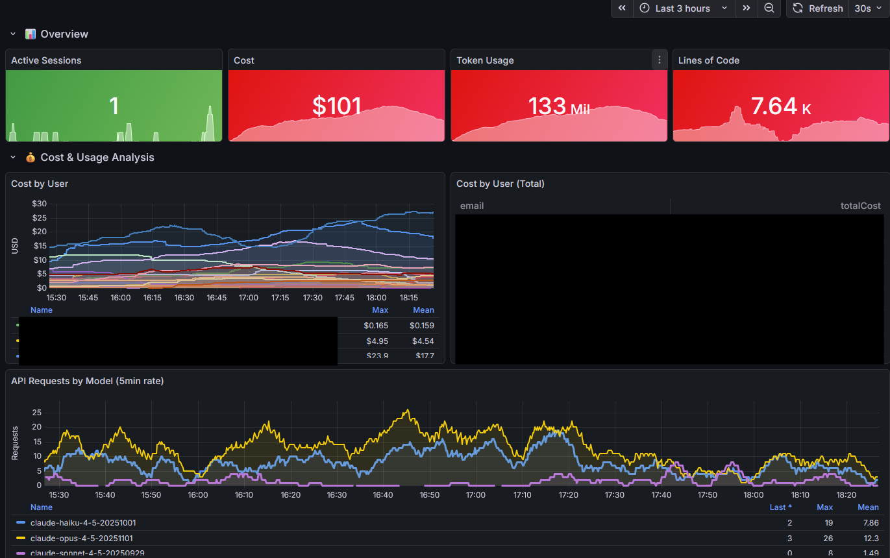
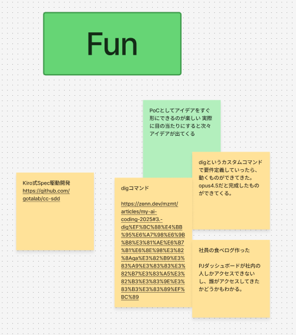

# Claude Codeを配ったのに使われない問題への処方箋


<div class="abs-br m-6 text-sm opacity-75">
  2026-02-13 Claude Code Meetup Japan #3
</div>

---
layout: center
---

# Claude Codeでさえ手放しでは組織に普及しない

---
layout: center
---

# Claude Codeを組織展開するときのハードル
- 利用申請がめんどくさい
- 使ってたら秘匿情報が流出しそう
- そもそも使い方わからん
- 仕事で使える箇所が少ない

---
layout: center
---

# ハードルを取っ払うためにやったこと
- 最低限のセキュリティ担保
- 利用状況の可視化
- Claude Codeができることを増やす
- 利用申請する会を作る

---
layout: center
---

# 最低限のセキュリティ担保

---

# 利用者が必ず適用すべき設定を配布

- managed-settings.jsonを利用して配布
- このjsonに書いた設定は最も優先される
- 最近Claude for Teamsなどでも配布できるようになった(beta)

```bash
sudo mkdir -p "$(dirname /etc/claude-code/managed-settings.json)" \
  && sudo tee /etc/claude-code/managed-settings.json > /dev/null <<'EOF'
{
  "permissions": {
    "allow": [],
    "deny": [
      "Bash(git push:*)",
      "Bash(docker push:*)",
      "Read(.env*)"
    ]
  }
}
```

---
layout: center
---

# 利用状況の可視化

---

# Otelによる観測システムを運用する



---
layout: center
---

# 観測環境は意外と簡単に構築できる
`make up` コマンド1つで前スライドの観測環境を構築可能


---
layout: center
---

# 利用状況の可視化 = 嫌なイメージがあるけど・・・
- ダッシュボードは全員見れるので誰がヘビーユーザーか分かる
- ナレッジ共有会が開かれるように



---
layout: center
---

# Claude Codeができることを増やす

---
layout: center
---

# Claude Codeを使った開発で大切なこと
- 出力の検証をできる
- 最新の情報にアクセスできる
- 作業をSkillとして再利用可能にする

こういうのは個人の資産に閉じがち

---
layout: center
---

# Claude Plugin Marketplaceを展開
- 業務で役立つSkillや内製MCPサーバーを簡単にインストールできるように

Plugin Marketplaceは簡単に作成 & 利用ができる

```json
// .claude-plugin/marketplace.json
{
  "name": "raccoon-claude-marketplace",
  // ~~~
  "plugins": [
    {
      "name": "change-manage-plugin",
      "source": "./plugins/change-manage-plugin",
      "description": "説明"
    },
  ]
}
```

```bash
# 1コマンドで導入可能
claude plugin marketplace add https://gitlab.com/~~/~~.git
```

---
layout: center
---

# その他細々としたこと

- 開発用社内DBに接続できるMCPサーバー
- 全リポジトリを横断検索可能なMCPサーバー
- BacklogにあるドキュメントをMarkdownとして参照できるように

---

---
layout: center
---

## 利用申請する会を作る

---
layout: center
---

- エンジニアの美徳の一つ「怠惰」
- 利用申請とセットアップがそもそも手間だった
- 申請からセットアップまでを一緒にやる会を設定
- **正直単純に利用者を増やすという点では１番効果があった**


---
layout: center
---

# 我々の仕事

## ❌️Claude Codeを使いこなす

## ⭕️良いプロダクトをユーザーに届ける

---
layout: center
---

## 社内のエンジニア全員がClaude Codeの情報を<br>キャッチアップしているわけではない

---

# これから導入する人/導入に苦戦する人に向けて

- managed-settings.jsonの配布
- 利用状況の可視化
- Claude Codeができることを増やす
- 利用申請のハードルを下げる

---
layout: two-cols
---

# 自己紹介

<div class="mt-4 space-y-4">

<div class="flex items-center gap-5">
  <div class="relative shrink-0">
    <div class="w-24 h-24 rounded-full overflow-hidden ring-4 ring-[#4EC5D4] ring-offset-2 ring-offset-white dark:ring-offset-gray-900 shadow-xl">
      
    </div>
  </div>
  <div>
    <div class="text-2xl font-bold">川崎 大河</div>
    <div class="opacity-70 mt-1">CTO室</div>
  </div>
</div>

<div class="mt-6 space-y-3">

**会社**  
ラクーンホールディングス株式会社

**役割**  
社内の技術的な仕組みづくり

</div>

</div>

::right::

<div class="pl-8 mt-12">

## ラクーンホールディングスとは

<div class="space-y-3 mt-4 text-sm">

<div class="p-3 bg-blue-50 dark:bg-blue-900/30 rounded border border-blue-200 dark:border-blue-700">
  🛒 <strong>SUPER DELIVERY</strong><br>
  <span class="opacity-70">企業間 EC プラットフォーム</span>
</div>

<div class="p-3 bg-green-50 dark:bg-green-900/30 rounded border border-green-200 dark:border-green-700">
  💳 <strong>Paid</strong><br>
  <span class="opacity-70">企業間後払い決済サービス</span>
</div>

</div>

</div>
